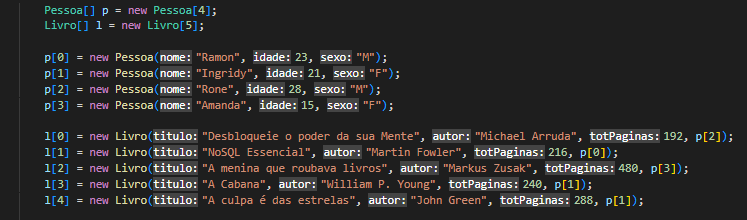
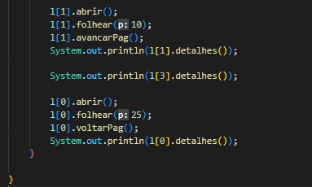
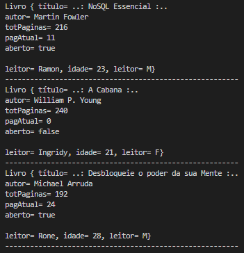

## Código - Projeto Livro 📚

  

### Java POO - Curso em Vídeo☕

Código desenvolvido na aula 9 do Curso em Vídeo - Java POO. Com esse projeto é possível alimentar o sistema e vincular um livro para um ou mais leitores e realizar compilação desses dados.

<strong>O programa vai exibir na tela as seguintes informações:</strong>

- [x] O título do livro, autor e total de páginas
- [x] Se o livro se encontra aberto e sua página atual
- [x] As informações sobre o leitor que está lendo o livro
  
## Compilação 👨🏽‍💻

### Inserindo dados no sistema 💻⬅

  

### Métodos personalizados 🛠

  

- [x] Com os métodos personalizados é possível abrir o livro, folhear páginas para a qual o usuário quer, avançar ou voltar páginas do livro também
- [x] como consequência de qualquer ação desses métodos a página atual muda dinâmicamente
- [x] <strong>Não é possível</strong> folhear páginas além da quantidade de páginas que o livro possuí, como resultado, caso isso acontencer a página atual volta para zero

## Tela de visualização 📃

  

## Tecnologias 🛠

- Java POO ☕

## Instrutor 👨🏽‍🏫
- <a target="_blank" href="https://www.linkedin.com/in/guanabara/">Gustavo Guanabara</a>

## Aluno 👨🏽‍🎓

- <a target="_blank" href="https://www.linkedin.com/in/ramon-barreto-076191180/">Ramon Barreto</a>

## Contato 📲

- Email: ramon_barreto_medrado@hotmail.com